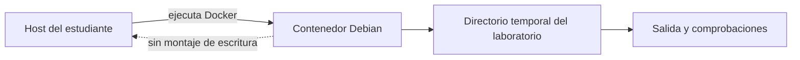

# Alcance, seguridad y laboratorio

**Estado:** draft

Un comando corto puede cambiar permisos, borrar información o afectar un
servicio. Antes de practicar Linux conviene definir el límite del experimento:
qué sistema toca, cómo se observa su efecto y cómo se deshace. Este contrato
convierte esa precaución en una propiedad verificable del curso.

## Concepto

Cada práctica se ejecuta dentro de un contenedor Debian creado para el curso.
Los datos de una práctica viven en un directorio temporal del contenedor y se
eliminan al terminar. El host del estudiante no forma parte del laboratorio.



## Problema que evita

Ejecutar ejemplos directamente en el equipo de trabajo mezcla aprendizaje con
información real: una ruta puede contener archivos importantes, un proceso
puede no ser el esperado y una llave de SSH puede quedar expuesta. Un comando
correcto en un contexto equivocado sigue siendo una operación incorrecta.

## Reglas invariantes

1. Las prácticas no usan `sudo` ni requieren privilegios adicionales.
2. No se montan directorios del host con permiso de escritura.
3. No se usan secretos, llaves privadas, datos de producción ni destinos
   externos para demostrar conectividad.
4. Toda eliminación opera sobre una ruta temporal creada por el laboratorio;
   no se enseña `rm -rf` como receta genérica.
5. Las señales solo apuntan a procesos creados por la propia práctica.
6. Cada script falla de forma explícita si se ejecuta fuera de su directorio
   temporal o si una precondición no se cumple.

## Flujo seguro

Antes de ejecutar una práctica, confirma la hipótesis y el alcance:

```bash
pwd
id
printf '%s\n' "Ruta esperada: \${LAB_ROOT:-no definida}"
```

Después, observa el resultado y deja que la limpieza sea parte de la práctica,
no un paso manual olvidable. En los scripts del curso, `trap` elimina solo el
directorio que el mismo script creó.

## Alternativas y límites

Una máquina virtual también puede aislar prácticas, y es preferible cuando se
necesita un kernel o un gestor de servicios real. Aquí Docker reduce el costo
de inicio y hace el entorno repetible. No simula por completo un host Linux:
en particular, Debian dentro de un contenedor no arranca `systemd` como PID 1.

Los comandos `systemctl`, `dnf` y `pacman` se explican para comparar modelos de
distribución, pero no se presentan como comandos ejecutables en este entorno.
Los ejercicios de red usan servicios locales del contenedor o de la red Docker;
no prueban acceso a sistemas públicos.

## Ejercicios

1. Explica por qué un directorio temporal es una mejor frontera que pedir al
   estudiante que tenga cuidado al elegir una ruta.
2. Identifica qué regla se rompe si un ejemplo lee `~/.ssh/id_ed25519`.
3. Propón una práctica de borrado seguro que demuestre recuperación mediante
   una copia, sin tocar un archivo fuera de `LAB_ROOT`.

## Soluciones

1. La frontera se puede comprobar y limpiar automáticamente; la atención
   humana no es una garantía reproducible.
2. Se rompe la prohibición de secretos y la frontera con el host.
3. Crear un archivo sintético bajo `LAB_ROOT`, copiarlo a una carpeta de
   respaldo del mismo árbol, eliminar solo la copia de trabajo y verificar que
   el respaldo sigue presente.
