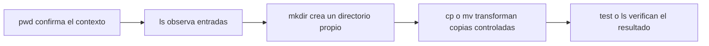

# Shell, archivos y texto

**Estado:** draft

## Navegación y archivos

### Concepto

La shell no es una colección de órdenes aisladas: es una forma de describir
transformaciones sobre nombres, rutas y flujos. Una ruta absoluta parte de
`/`; una ruta relativa se interpreta desde el directorio de trabajo actual.
El directorio actual es estado implícito y por eso merece observarse antes de
modificar archivos.



### Problema

El mismo `rm`, `mv` o `cp` cambia de significado según la ruta desde la que se
ejecute. Confiar en la memoria del directorio actual es una fuente común de
pérdida de información. Antes de una operación con efectos, la hipótesis debe
ser: "esta ruta pertenece a mi espacio temporal y contiene exactamente lo que
espero".

### Alternativas y justificación

- `pwd` y `ls` son observaciones baratas; úsalos antes de una escritura.
- Rutas absolutas reducen ambigüedad en scripts; rutas relativas hacen más
  legible una práctica cuyo directorio se crea y valida explícitamente.
- `cp` conserva la fuente y es útil para experimentar; `mv` cambia el nombre o
  mueve la entrada y exige una verificación posterior.
- Un enlace simbólico nombra otra ruta; un enlace duro comparte el mismo inode.
  Los enlaces duros no cruzan sistemas de archivos y, normalmente, no apuntan
  a directorios. Elige un enlace simbólico cuando quieres expresar una
  referencia que pueda verse y reemplazarse.

### Ejemplo progresivo

Trabaja siempre bajo la frontera declarada por el curso:

```bash
source scripts/lab-lib.sh
work="$(new_lab_dir)"
trap 'cleanup_lab_dir "$work"' EXIT

printf 'primera versión\n' >"$work/nota.txt"
mkdir "$work/archivo"
cp "$work/nota.txt" "$work/archivo/copia.txt"
ln -s "archivo/copia.txt" "$work/nota-actual"
find "$work" -maxdepth 2 -printf '%y %p -> %l\n'
```

El enlace usa una ruta relativa porque ambos nombres viven dentro de `work`.
La comprobación final muestra tipo, ruta y destino antes de seguir.

### Operaciones de riesgo y recuperación

Nunca pruebes un patrón de eliminación sobre una ruta real. Primero inspecciona
la selección y conserva un respaldo dentro del mismo laboratorio:

```bash
find "$work" -maxdepth 1 -type f -print
cp "$work/nota.txt" "$work/nota.txt.bak"
rm -- "$work/nota.txt"
test -f "$work/nota.txt.bak"
```

`--` termina las opciones, por lo que un nombre que empieza con `-` no se
interpreta como una bandera. No existe una papelera universal para `rm`: la
recuperación depende de haber creado una copia o de un respaldo previo.

### Ejercicios

1. Crea `entrada/`, copia un archivo a `salida/` y verifica con `test -f` que
   ambas copias existen.
2. Sustituye el enlace simbólico del ejemplo para que apunte a una versión
   nueva sin cambiar el consumidor que lee `nota-actual`.
3. Explica por qué `rm -rf "$work"` no es una plantilla para una ruta elegida
   por el usuario.

### Soluciones

1. Usa `mkdir -p "$work/entrada" "$work/salida"`, crea la fuente, ejecuta
   `cp --` y comprueba ambos nombres con `test -f`.
2. Crea el archivo nuevo y ejecuta `ln -sfn -- "archivo/nueva.txt"
   "$work/nota-actual"`; después inspecciona el destino con `readlink`.
3. Porque una variable mal validada puede quedar vacía o apuntar fuera del
   laboratorio. El curso solo permite limpiar directorios creados y validados
   por `new_lab_dir`.
