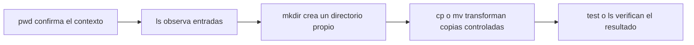
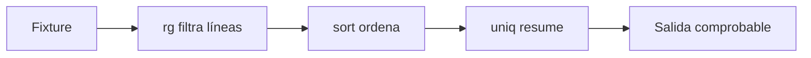

# Shell, archivos y texto

**Estado:** draft

## Navegación y archivos

### Concepto

La shell no es una colección de órdenes aisladas: es una forma de describir
transformaciones sobre nombres, rutas y flujos. Una ruta absoluta parte de
`/`; una ruta relativa se interpreta desde el directorio de trabajo actual.
El directorio actual es estado implícito y por eso merece observarse antes de
modificar archivos.



### Problema

El mismo `rm`, `mv` o `cp` cambia de significado según la ruta desde la que se
ejecute. Confiar en la memoria del directorio actual es una fuente común de
pérdida de información. Antes de una operación con efectos, la hipótesis debe
ser: "esta ruta pertenece a mi espacio temporal y contiene exactamente lo que
espero".

### Alternativas y justificación

- `pwd` y `ls` son observaciones baratas; úsalos antes de una escritura.
- Rutas absolutas reducen ambigüedad en scripts; rutas relativas hacen más
  legible una práctica cuyo directorio se crea y valida explícitamente.
- `cp` conserva la fuente y es útil para experimentar; `mv` cambia el nombre o
  mueve la entrada y exige una verificación posterior.
- Un enlace simbólico nombra otra ruta; un enlace duro comparte el mismo inode.
  Los enlaces duros no cruzan sistemas de archivos y, normalmente, no apuntan
  a directorios. Elige un enlace simbólico cuando quieres expresar una
  referencia que pueda verse y reemplazarse.

### Ejemplo progresivo

Trabaja siempre bajo la frontera declarada por el curso:

```bash
source scripts/lab-lib.sh
work="$(new_lab_dir)"
trap 'cleanup_lab_dir "$work"' EXIT

printf 'primera versión\n' >"$work/nota.txt"
mkdir "$work/archivo"
cp "$work/nota.txt" "$work/archivo/copia.txt"
ln -s "archivo/copia.txt" "$work/nota-actual"
find "$work" -maxdepth 2 -printf '%y %p -> %l\n'
```

El enlace usa una ruta relativa porque ambos nombres viven dentro de `work`.
La comprobación final muestra tipo, ruta y destino antes de seguir.

### Operaciones de riesgo y recuperación

Nunca pruebes un patrón de eliminación sobre una ruta real. Primero inspecciona
la selección y conserva un respaldo dentro del mismo laboratorio:

```bash
find "$work" -maxdepth 1 -type f -print
cp "$work/nota.txt" "$work/nota.txt.bak"
rm -- "$work/nota.txt"
test -f "$work/nota.txt.bak"
```

`--` termina las opciones, por lo que un nombre que empieza con `-` no se
interpreta como una bandera. No existe una papelera universal para `rm`: la
recuperación depende de haber creado una copia o de un respaldo previo.

### Ejercicios

1. Crea `entrada/`, copia un archivo a `salida/` y verifica con `test -f` que
   ambas copias existen.
2. Sustituye el enlace simbólico del ejemplo para que apunte a una versión
   nueva sin cambiar el consumidor que lee `nota-actual`.
3. Explica por qué `rm -rf "$work"` no es una plantilla para una ruta elegida
   por el usuario.

### Soluciones

1. Usa `mkdir -p "$work/entrada" "$work/salida"`, crea la fuente, ejecuta
   `cp --` y comprueba ambos nombres con `test -f`.
2. Crea el archivo nuevo y ejecuta `ln -sfn -- "archivo/nueva.txt"
   "$work/nota-actual"`; después inspecciona el destino con `readlink`.
3. Porque una variable mal validada puede quedar vacía o apuntar fuera del
   laboratorio. El curso solo permite limpiar directorios creados y validados
   por `new_lab_dir`.

## Texto, pipes y búsqueda

### Concepto

Los programas Unix producen texto por salida estándar y reciben texto por
entrada estándar. Un pipe conecta esas dos fronteras sin crear un archivo
intermedio. La redirección cambia el destino de un flujo; no transforma los
datos por sí sola.



### Problema

Una cadena de comandos parece compacta, pero puede ocultar supuestos sobre
espacios, codificación, orden y errores. El problema no es usar pipes: es no
saber cuál comando selecciona, transforma, ordena o consume cada dato.

### Herramientas y alternativas

- `cat`, `less`, `head`, `tail` y `wc` observan contenido; `less` es mejor
  para lectura humana y `head` o `tail` para muestras acotadas.
- `grep` y `rg` buscan patrones. `rg` es rápido y respeta habitualmente
  `.gitignore`; `grep` está disponible en casi todo sistema Unix.
- `sort` establece un orden explícito; `uniq` solo agrupa duplicados contiguos,
  de modo que normalmente recibe una salida ordenada.
- `cut` sirve para campos sencillos con delimitador fijo; `awk` expresa reglas
  por campos y `sed` transforma líneas. Cuando la entrada es JSON, CSV con
  comillas o datos binarios, usa un parser especializado, no una tubería de
  texto improvisada.
- `find` recorre un árbol; `xargs` construye argumentos. Para nombres con
  espacios o saltos de línea, usa `-print0` y `xargs -0`.

### Ejemplo progresivo

El quoting conserva el límite de cada argumento y la entrada se mantiene
sintética dentro del laboratorio:

```bash
printf '%s\n' api worker api api worker >"$work/servicios.txt"
rg --fixed-strings 'api' "$work/servicios.txt" \
  | sort \
  | uniq -c \
  | awk '{ print $2 ":" $1 }'
```

La salida `api:3` se puede verificar sin depender de logs externos. Para
guardar la evidencia, redirige solo al final: `... >"$work/resumen.txt"`.
Usa `>>` únicamente cuando el contrato exige anexar; de otro modo puede mezclar
una ejecución anterior con la actual.

### Límites de expansión y errores

No uses `for file in $(find ...)`: la shell separa por espacios y globbing.
Prefiere que `find` invoque una acción segura o use una frontera nula:

```bash
find "$work" -type f -name '*.txt' -print0 \
  | xargs -0 -r rg --fixed-strings --line-number 'api'
```

Con `set -o pipefail`, un fallo en cualquier etapa hace fallar la práctica. Sin
esa opción, la shell suele conservar solo el estado del último comando y puede
ocultar una selección vacía o una lectura fallida.

### Ejercicios

1. Crea una lista de entornos repetidos y produce un conteo ordenado por nombre.
2. Busca una palabra literal que contiene `.` sin convertirla en una expresión
   regular.
3. Explica cuándo `cut -d, -f2` deja de ser una forma correcta de leer CSV.

### Soluciones

1. Ordena la lista antes de `uniq -c`, y usa `sort -k2,2` si deseas ordenar
   por el nombre que acompaña al conteo.
2. Usa `rg --fixed-strings 'v1.2' archivo`; el modo literal no trata `.` como
   comodín.
3. Deja de ser correcto cuando existen comas entre comillas, escapes o saltos
   de línea dentro de un campo. Se requiere un parser de CSV.
