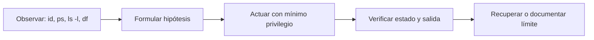

# Procesos, permisos y almacenamiento

**Estado:** draft

## Concepto

Linux representa archivos, procesos y permisos mediante datos observables. Un
proceso tiene PID, usuario, estado y entorno; una entrada de sistema de
archivos tiene propietario, grupo y bits de permiso. Observar esos datos antes
de actuar convierte una intuición en diagnóstico.



## Problema

Un permiso denegado no se arregla automáticamente con privilegios elevados, y
un PID no identifica por sí solo el proceso correcto. Resolver síntomas con
`sudo`, `chmod 777` o señales amplias borra la evidencia y expande el alcance
del daño potencial.

## Permisos, usuarios y entorno

`id` muestra el usuario efectivo y sus grupos. `ls -l` muestra permisos como
lectura, escritura y ejecución para propietario, grupo y otros. `umask` define
qué bits se eliminan de los permisos iniciales de un archivo nuevo; no sustituye
una política de acceso explícita.

```bash
umask 077
printf 'dato sintético\n' >"$work/solo-yo.txt"
stat --format '%a %U %G %n' "$work/solo-yo.txt"
chmod u+rw,go-rwx -- "$work/solo-yo.txt"
```

Evita `chmod -R` si no has enumerado el árbol y justificado cada tipo de
entrada. En este curso no se ejecutan `chown` ni `sudo`: el laboratorio ya
corre como el usuario sin privilegios `learner`.

## Procesos y señales

`ps` lista una fotografía; `pgrep` selecciona por nombre o atributo; `kill`
envía una señal, no necesariamente termina un proceso. Empieza por `TERM` para
permitir limpieza y usa `KILL` solo cuando has comprobado que el proceso propio
no responde. Nunca uses una selección ambigua como `killall` en un entorno que
no controlas.

```bash
sleep 30 &
pid=$!
ps -o pid,user,stat,command -p "$pid"
kill -TERM "$pid"
wait "$pid" || test "$?" -eq 143
```

El PID se captura desde el proceso que acabas de crear. Esa es la invariante
que permite practicar señales sin afectar procesos ajenos.

## Almacenamiento y límites

`df -h` responde cuánto espacio tiene el sistema de archivos; `du -sh ruta`
estima cuánto ocupa un árbol; `lsblk` describe dispositivos del host o del
contenedor. Son preguntas distintas. Dentro de Docker, `lsblk`, `mount` y la
capacidad observada pueden reflejar una virtualización, no la topología real
del equipo anfitrión.

No se enseñan `mount`, `fdisk` ni cambios de particiones como ejercicios: son
operaciones de administración que requieren un entorno desechable apropiado y
una decisión humana sobre los datos que pueden destruir.

## Ejercicios

1. Crea un archivo con `umask 077` y explica los bits que esperas observar.
2. Inicia un proceso `sleep`, guarda su PID, envía `TERM` y verifica su salida.
3. Compara qué responde `df` frente a `du` dentro del directorio del laboratorio.

## Soluciones

1. El archivo nace normalmente como `600`: lectura y escritura para el usuario
   actual, sin permisos para grupo u otros.
2. Usa `$!`, inspecciona con `ps -p "$pid"`, llama `kill -TERM "$pid"` y
   espera con `wait`; no selecciones por un nombre global.
3. `df` informa capacidad del sistema de archivos que contiene la ruta; `du`
   suma el espacio que ocupan las entradas del árbol indicado.
