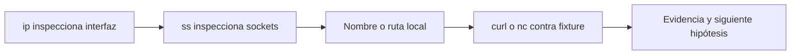

# Redes, acceso remoto y servicios

**Estado:** draft

## Diagnóstico de red, SSH y transferencias

### Concepto

Una conexión es una cadena de capas: nombre, ruta, interfaz, socket, proceso y
protocolo. El diagnóstico útil avanza desde observaciones locales hacia una
hipótesis concreta, en lugar de lanzar comandos remotos hasta que alguno
parezca funcionar.



### Herramientas y límites

`ip addr` e `ip route` describen interfaces y rutas. `ss -ltnp` muestra
sockets de escucha y, cuando hay permisos suficientes, su proceso asociado.
`ping`, `dig` y `traceroute` responden preguntas distintas: conectividad ICMP,
resolución DNS y saltos de una ruta. Ninguno demuestra por sí solo que una
aplicación HTTP o SSH esté sana.

Los laboratorios solo usan servicios locales de Docker. No enseñan a probar
puertos de terceros ni a enviar tráfico a infraestructura ajena.

### SSH y transferencia segura

SSH autentica un canal remoto; `scp` y `rsync` transfieren archivos sobre ese
canal. No copies llaves privadas a scripts ni desactives la verificación del
host para silenciar advertencias. Antes de una primera conexión real, verifica
la huella de host por un canal independiente y usa una llave limitada al
servicio y entorno necesarios.

```bash
ssh -o BatchMode=yes -o StrictHostKeyChecking=yes usuario@host.example
rsync --archive --dry-run -- item/ usuario@host.example:destino/
```

El comando ilustra opciones, pero no se ejecuta en el laboratorio: no hay host
ni credenciales externas. `--dry-run` en `rsync` permite revisar el plan antes
de transferir; no reemplaza revisar el destino ni la política de retención.

### Reenvío de puertos

El reenvío local convierte un puerto local en una ruta hacia otro servicio.
Es útil para administración puntual, pero amplía la superficie visible del
equipo. Liga el puerto a `127.0.0.1`, limita su duración y ciérralo cuando
termines. No uses `GatewayPorts` o una dirección pública sin un requisito y
una revisión explícitos.

### Ejercicios

1. Distingue la evidencia que aporta `ss -ltn` de la que aporta una petición
   `curl` a un servicio local.
2. Explica por qué `StrictHostKeyChecking=no` no es una solución estable.
3. Diseña el orden de diagnóstico para un servicio local que no responde.

### Soluciones

1. `ss` confirma una escucha TCP; `curl` prueba además una conversación del
   protocolo de aplicación.
2. Elimina una comprobación de identidad y permite aceptar un host inesperado.
   La solución es registrar y verificar la huella correcta.
3. Observa interfaz y socket, identifica el proceso propio, prueba el endpoint
   local y conserva la salida antes de cambiar configuración.
