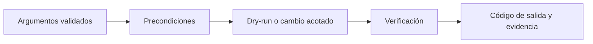

# Automatización y operación segura

**Estado:** draft

## Bash con contratos explícitos

### Concepto

Un script convierte una secuencia de operaciones en una interfaz. Sus
argumentos, variables de entorno, código de salida y archivos que toca son su
contrato. Automatizar una orden insegura no la vuelve segura: hace repetible su
alcance, incluido cualquier error.



### Fundamentos

Empieza scripts con `set -euo pipefail`: falla ante un comando no controlado,
una variable no definida y una etapa fallida de un pipe. No sustituye entender
errores esperados: para esos casos, captura y justifica el código de salida.

```bash
#!/usr/bin/env bash
set -euo pipefail

usage() { printf 'Uso: %s [--dry-run] <ruta>\n' "$0" >&2; }
```

Usa funciones pequeñas, comillas alrededor de expansiones y `--` antes de rutas.
Prefiere arrays para listas de argumentos; concatenar comandos en cadenas obliga
a reanalizar quoting y abre errores de expansión.

### Operación y recuperación

Una operación mutante debe ofrecer una vista previa o una confirmación cuando
el entorno no es desechable. Los laboratorios usan dry-run y directorios
temporales; un sistema real además necesita respaldo, ventana de cambio,
observabilidad y propietario de la recuperación.

```bash
if [ "${DRY_RUN:-0}" = "1" ]; then
  printf 'dry-run: movería %q a %q\n' "$source" "$destination"
else
  mv -- "$source" "$destination"
fi
```

`trap` permite limpiar recursos propios al salir, pero no debe borrar rutas
recibidas sin validar. Un script solo limpia el directorio que él mismo creó
bajo la frontera del laboratorio.

### Ejercicios y soluciones

1. Escribe una función que rechace una ruta fuera de `LAB_ROOT`.
   Solución: compara la ruta validada contra el prefijo permitido y retorna un
   error antes de cualquier escritura.
2. Agrega `--dry-run` a un movimiento. Solución: parsea la opción, imprime los
   argumentos con `%q` y no invoca `mv` cuando está activa.
3. Explica por qué no se usa `eval`. Solución: evalúa texto como código y hace
   que quoting y datos no confiables cambien la estructura del comando.
