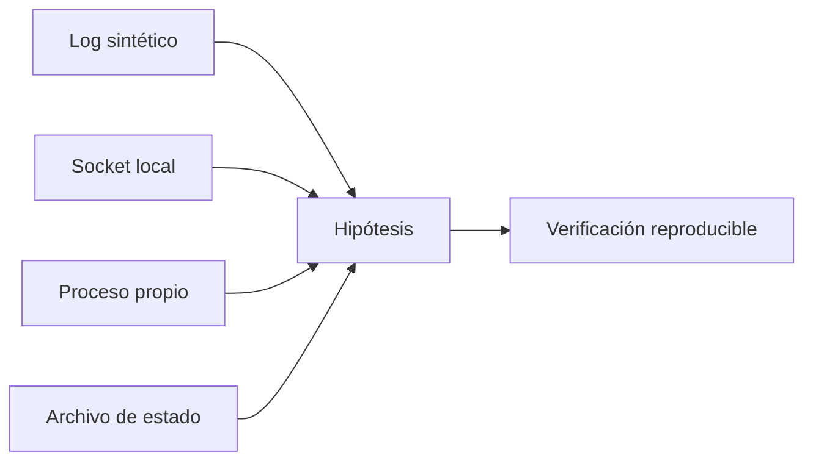

# Laboratorio integrador, glosario y cierre

**Estado:** draft

## Glosario

- **Dry-run:** ejecución que muestra el cambio previsto sin realizarlo.
- **Frontera de laboratorio:** límite verificable que restringe archivos,
  procesos y red a recursos creados para la práctica.
- **Inode:** identidad de una entrada de sistema de archivos; un enlace duro
  puede compartirla con otro nombre.
- **Pipe:** conexión de la salida estándar de un proceso con la entrada estándar
  de otro.
- **PID:** identificador de un proceso dentro de su espacio de procesos.
- **Socket:** extremo de comunicación identificado por protocolo, dirección y
  puerto o por una ruta local.
- **Umask:** máscara que elimina permisos de los permisos iniciales de una
  entrada nueva.

## Diagnóstico de un servicio local

### Concepto y problema

Un incidente pequeño rara vez se entiende desde una sola orden. El caso
integrador simula un servicio local que escribe un log, escucha en loopback y
expone un archivo de estado con permisos restringidos. La tarea no es
"reiniciarlo hasta que funcione": es recolectar evidencia suficiente para
explicar su estado y aplicar solo un cambio recuperable.

### Recorrido del laboratorio

1. Identifica el directorio temporal y el usuario efectivo.
2. Lee el log completo antes de filtrar el evento de advertencia.
3. Comprueba con `ss` que el socket pertenece al servicio propio.
4. Inspecciona el permiso del archivo de estado antes de corregirlo.
5. Envía una petición local, conserva la salida y espera al proceso creado por
   la práctica.
6. Comprueba que la limpieza eliminó únicamente el directorio temporal.

### Alternativas y límites

El caso no modela un despliegue distribuido, un gestor `systemd`, TLS real ni
credenciales. Para esos escenarios, el siguiente paso es un entorno que
represente explícitamente sus componentes y una política de acceso. La lección
transferible es el método: observar, formular hipótesis, actuar dentro de una
frontera y verificar la evidencia posterior.

### Ejercicios

1. Cambia el fixture para representar una advertencia repetida y adapta la
   comprobación sin usar una búsqueda ambigua.
2. Añade un modo dry-run que enumere la evidencia que revisaría el caso.
3. Explica por qué un socket abierto no prueba que el servicio procese una
   solicitud correctamente.

### Soluciones

1. Busca el identificador literal del evento y comprueba el conteo esperado.
2. Imprime rutas y comandos de observación, sin crear socket ni modificar el
   archivo de estado.
3. Una escucha solo prueba que alguien acepta conexiones; la petición y su
   evidencia prueban una parte adicional del protocolo y del manejo de datos.

## Ruta de lectura y verificación

Lee primero el contrato de laboratorio, continúa por shell y sistema local, y
después por conectividad y automatización. Ejecuta los scripts de `tests/` en
un entorno con Docker disponible; cada uno construye la misma imagen Debian y
se ejecuta sin red externa. Esta repetición es deliberada: la evidencia de una
práctica no debe depender de efectos residuales de otra.

El curso no está revisado ni publicado. Sus laboratorios demuestran contratos
locales y sus límites; no certifican un host de producción, una configuración
organizacional ni un sistema remoto.
